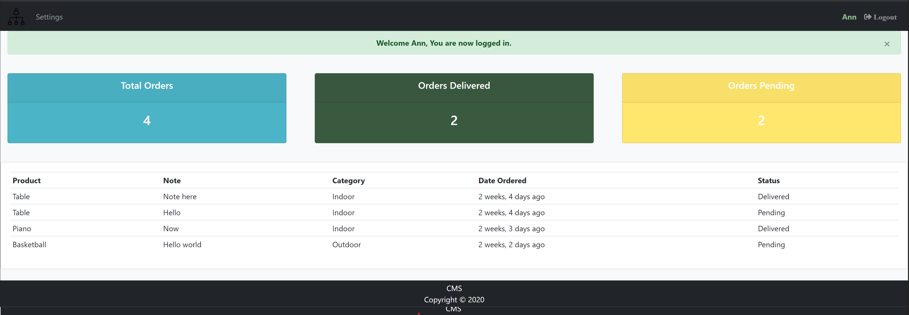
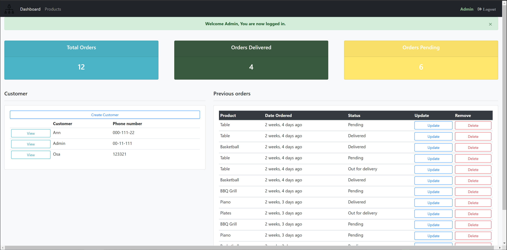
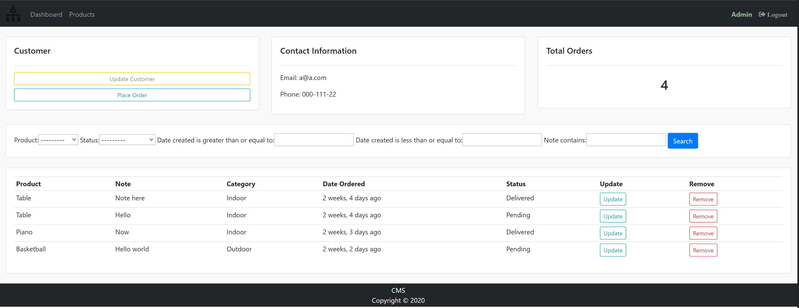
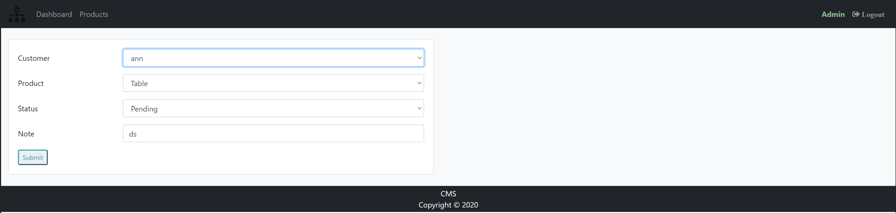
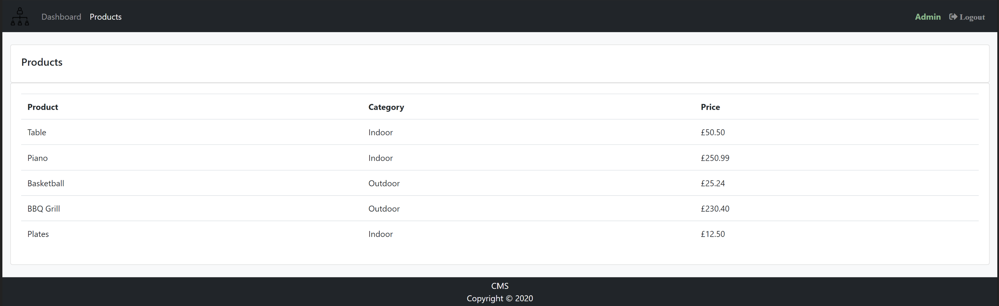
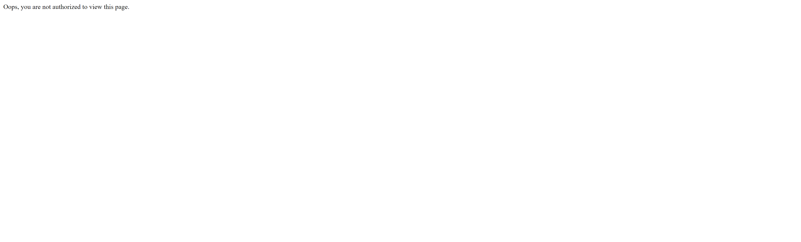
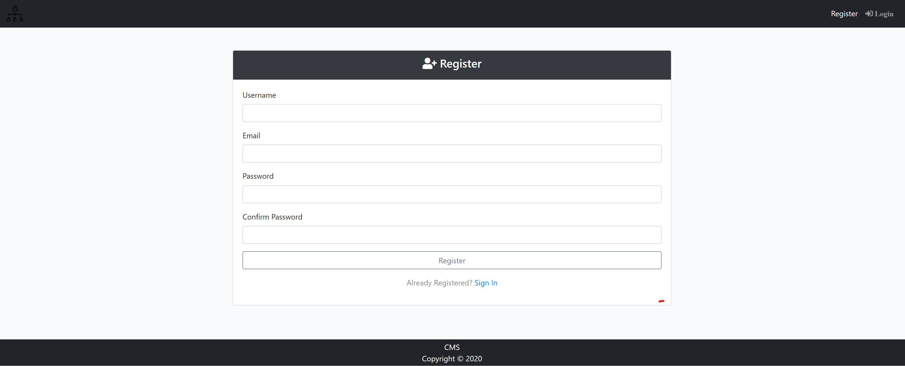
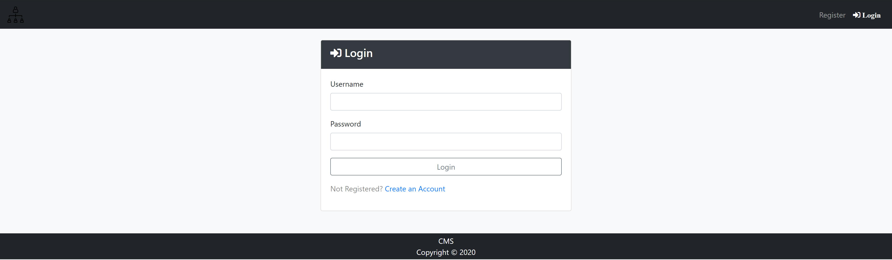
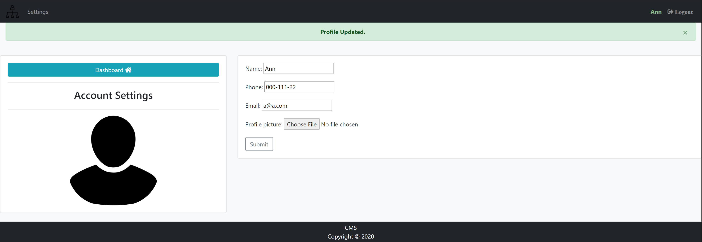

## Customer Management Application which stores customers information in a database (PostgreSQL).

App Breakdown
---
---
### Two types of users
#### Customer
- [x] pages only shown to the customer includes, the customer's dashboard, customer's order, profile setting.
- [x] an admin is denied access to any of the above pages and is shown an unauthorised message.
- [x] when a customer logs in, the customer is redirected to the customer dashboard.

#### Admin
- [x] pages only shown to the admin are, admins dashboard, products, creating, updating, and deleting orders.
- [x] a customer is denied access to any of these pages and is shown an unauthorised message. 
- [x] when an admin logs in, the admin is redirected to the admin dashboard.

  
 |  
-------------------------- | --------------------------
 | 
 |  

### Registration
- [x] post-save() signal is used to create a customer profile after the user is saved.
- [x] the customer is given a default profile picture.
- [x] a new user is automatically added to the 'customer' group (a user can only be added to the 'admin' group from the admin site).

 |  
-------------------------- | --------------------------
 

---
### Going to the registration page when logged in
- [x] if a customer tries to access the registration page via the url, the customer is automatically taken back to the customer's dashboard via the custom decorator.
- [x] if an admin tries to access the registration page via the url, the admin is automatically taken back to the admin' dashboard via the custom decorator.

### Going to the login page when logged in
- [x] if a customer tries to access the login page via the url, the customer is automatically taken back to the customer's dashboard via the custom decorator.
- [x] if an admin tries to access the login page via the url, the admin is automatically taken back to the admin' dashboard via the custom decorator.
---
